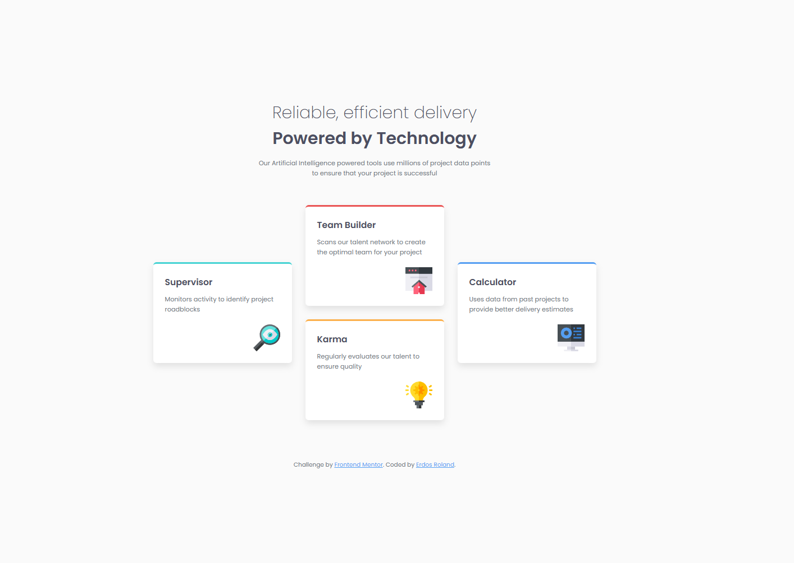

# Four Card Feature Section

A responsive solution to the Frontend Mentor Four Card Feature Section challenge.

The layout is built with a mobile-first approach using CSS Grid for the card layout and Flexbox for card content alignment.

## Screenshot

## What I learned

- How to structure a semantic layout with main, section, and article
- How to build a mobile-first workflow in CSS
- How to use CSS Grid for multi-column responsive layout
- How to combine Grid and Flexbox in one component system

## Built with

- HTML5
- CSS3
- CSS Grid
- Flexbox

## Author

- GitHub - [TheReaper02](https://github.com/TheReaper02)
